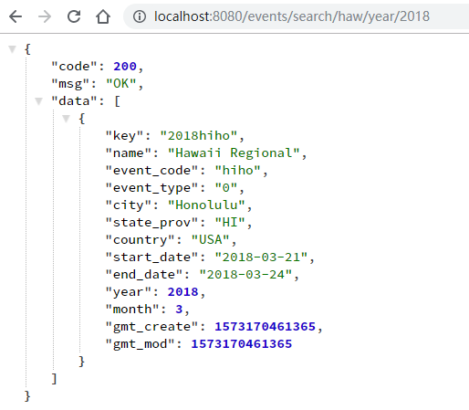

# Towero wechat-app backend
A restful style api sever enables fetching teams and events data of FRC (First Robotic Competition). The sever will run on port 8080 by default.

Techniques: Java, Maven, SpringBoot, MySql

TODO: Write the APIs document.